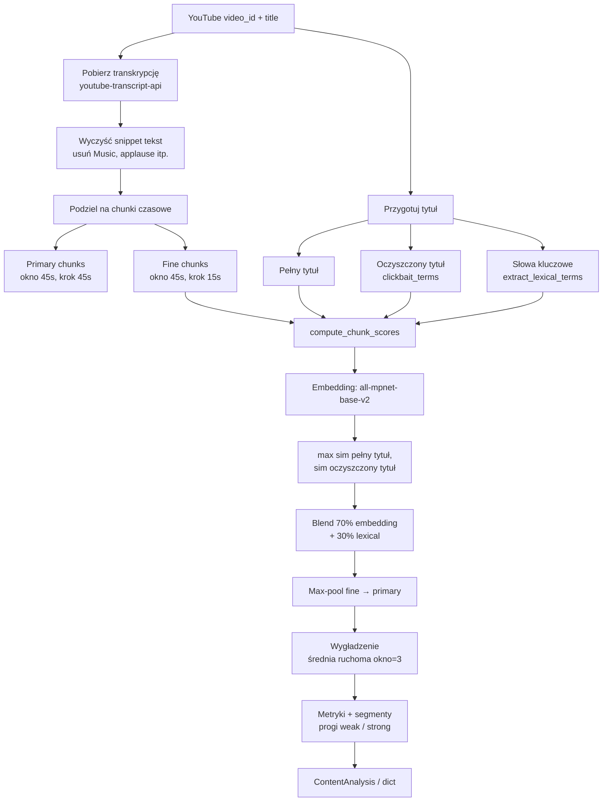

# WorthIt / clickbait_search

Narzędzie do analizy filmów YouTube: sprawdza, czy **tytuł** wygląda na clickbait i czy **transkrypcja** faktycznie dotyczy obiecanego tematu.

---

## Struktura projektu

| Plik | Rola |
|------|------|
| `analyze_content.py` | Porównanie tytułu z transkrypcją (embeddingi + dopasowanie słów) |
| `analyze_title.py` | Ocena stylu tytułu (caps, interpunkcja, VADER, słownik clickbait) |
| `clickbait_terms.py` | Lista fraz i słów clickbait (reguły, nie model ML) |
| `yt_utils.py` | Parsowanie URL YouTube, pobieranie tytułu ze strony |
| `gui.py` | Interfejs Streamlit (łączy analizę tytułu i treści) |
| `app.py` | CLI — uruchamia obie analizy po kolei |

---

## Modele i biblioteki ML/NLP

### `analyze_content.py`

| Komponent | Nazwa / pakiet | Do czego |
|-----------|----------------|----------|
| **Model embeddingów** | `sentence-transformers/all-mpnet-base-v2` | Zamiana tytułu i kawałków transkrypcji na wektory znaczenia; porównanie przez cosine similarity |
| **Loader modelu** | `sentence_transformers.SentenceTransformer` | Ładowanie i cache modelu (`@lru_cache`) |
| **Podobieństwo wektorów** | `sklearn.metrics.pairwise.cosine_similarity` | Cosine similarity między wektorem tytułu a wektorami chunków |
| **Transkrypcja YouTube** | `youtube-transcript-api` (`YouTubeTranscriptApi`) | Pobieranie napisów / transkrypcji |
| **Operacje numeryczne** | `numpy` | Wygładzanie wyników, statystyki, segmenty |

Pierwsze uruchomienie pobiera model mpnet (~420 MB). Kolejne analizy w tej samej sesji używają cache.

### `analyze_title.py` (kontekst dla GUI)

| Komponent | Nazwa / pakiet | Do czego |
|-----------|----------------|----------|
| **Analiza sentymentu** | `vaderSentiment` (`SentimentIntensityAnalyzer`) | Wynik `compound` — emocjonalność / polaryzacja tytułu |
| **Słownik clickbait** | `clickbait_terms.py` (`PHRASES`, `WORDS`) | Reguły, nie model — wykrywanie buzzwordów |

---

## Schemat działania `analyze_content.py`



---

## Pipeline krok po kroku

### 1. Pobranie transkrypcji

- API: `YouTubeTranscriptApi().fetch(video_id, languages=["en"])`
- Każdy snippet: `text`, `start`, `duration`
- Czas filmu: `total_time = max(start + duration)` ostatniego snippetu

### 2. Czyszczenie tekstu transkrypcji

Usuwane są tylko **znane śmieci**, nie wszystkie nawiasy:

- `[Music]`, `[Applause]`, `[Laughter]` …
- `(applause)`, `(laughter)`, `(inaudible)` …
- symbol `♪`

Tekst typu `(Python 3.12)` **zostaje**.

### 3. Chunki czasowe

Dwa poziomy:

| Typ | Okno | Krok | Cel |
|-----|------|------|-----|
| **Primary** | 45 s | 45 s | Metryki, wykres, segmenty, raport |
| **Fine** | 45 s | 15 s | Dokładniejsze wykrywanie krótkich momentów o temacie |

Fine chunki są oceniane, potem wynik jest **max-poolowany** na primary (najlepszy wynik z nakładających się okien trafia do chunka 45s).

### 4. Przygotowanie tytułu

**Oczyszczony tytuł** (`clean_title_for_embedding`):

- Usuwa frazy z `PHRASES` (np. `"you won't believe"`)
- Usuwa słowa z `WORDS` (np. `"shocking"`, `"insane"`)
- Służy do drugiego embeddingu (mniej clickbaitu, więcej tematu)

**Słowa kluczowe** (`extract_lexical_terms`):

- Tekst w cudzysłowach
- Frazy Title Case (`New York`)
- Akronimy (`GPT`, `API`)
- Liczby / wersje (`3.12`, `2024`)
- Istotne słowa z oczyszczonego tytułu (>3 znaki, bez stopwords)

### 5. Warstwa 1 — embedding (dual title)

Model: **`sentence-transformers/all-mpnet-base-v2`**

Dla każdego chunka:

1. `embed_score = max(cos_sim(pełny_tytuł, chunk), cos_sim(oczyszczony_tytuł, chunk))`
2. Pełny tytuł łapie styl nagłówka; oczyszczony — merytoryczny temat

### 6. Warstwa 2 — dopasowanie leksykalne

```
lex_score = (liczba znalezionych słów kluczowych z tytułu) / (liczba wszystkich terminów)
```

### 7. Wynik końcowy na chunk

```
chunk_score = 0.7 × embed_score + 0.3 × lex_score
```

Stałe: `EMBED_WEIGHT = 0.7`, `LEXICAL_WEIGHT = 0.3`

### 8. Agregacja i wygładzenie

1. Fine scores → max-pool na primary chunks
2. **Wygładzenie**: średnia ruchoma z oknem `SMOOTH_WINDOW = 3` (3 chunki × 45 s ≈ 2 min kontekstu)
3. Wygładzone `scores` idą do metryk, segmentów i wykresu w GUI
4. Surowe wyniki zostają w polu `raw_scores`

---

## Progi (thresholds)

Dostrojone pod **all-mpnet-base-v2** + blend 70/30.

| Stała | Wartość | Znaczenie |
|-------|---------|-----------|
| `WEAK_THRESHOLD` | `0.30` | Temat luźno obecny |
| `STRONG_THRESHOLD` | `0.45` | Temat wyraźnie omawiany |

Orientacyjna interpretacja pojedynczego chunka:

| Zakres score | Interpretacja |
|--------------|---------------|
| < 0.25 | raczej niepowiązane |
| 0.25 – 0.35 | luźnie powiązane (ta sama dziedzina) |
| 0.35 – 0.50 | wyraźnie powiązane |
| ≥ 0.50 | bezpośrednio o temacie tytułu |

W GUI i logice werdyktu używaj **`ac.WEAK_THRESHOLD`** i **`ac.STRONG_THRESHOLD`**, nie wpisuj liczb na sztywno.

---

## Metryki wyjściowe (`ContentAnalysis`)

Funkcja `compute_content_analysis()` zwraca obiekt; `analyze_content()` zwraca `dict` przez `.to_dict()`.

| Pole | Opis |
|------|------|
| `chunks` | Primary chunki `{text, start, end}` |
| `scores` | Wygładzone wyniki 0–1 na chunk |
| `raw_scores` | Wyniki przed wygładzeniem |
| `best_index` | Indeks chunka z najwyższym score |
| `best_chunk` | Chunk z najlepszym dopasowaniem |
| `peak_match_pct` | Najlepszy wynik × 100 (alias: `peak_alignment_pct`) |
| `avg_match_pct` | Średnia ze wszystkich chunków × 100 |
| `topic_density_pct` | % chunków ≥ `STRONG_THRESHOLD` |
| `signal_chaos_pct` | Odchylenie standardowe scores × 100 |
| `first_weak_index` | Pierwszy chunk ≥ weak (lub `null`) |
| `first_strong_index` | Pierwszy chunk ≥ strong (lub `null`) |
| `first_strong_pct` | Po ilu % długości filmu pojawia się pierwszy strong moment |
| `total_time` | Długość filmu w sekundach (z transkrypcji) |
| `weak_segments` | Lista odcinków czasu z score ≥ weak |
| `strong_segments` | Lista odcinków czasu z score ≥ strong |

---

## API — główne funkcje

```python
# Logika bez printów (GUI, testy)
result = compute_content_analysis(title, video_id)  # ContentAnalysis | None

# CLI + opcjonalny raport
data = analyze_content(title, video_id, verbose=True)  # dict | None

# Model (cache)
model = get_embedding_model()  # SentenceTransformer(MODEL_NAME)
```

---

## Werdykt w GUI (`gui.py`) — progi pomocnicze

Logika werdyktu zostaje na razie w `gui.py`. Używa metryk z `analyze_content` plus `title_score` z `analyze_title`.

| Sygnał | Próg | Źródło |
|--------|------|--------|
| Clickbaitowy tytuł | `title_score >= 0.50` | `analyze_title.py` |
| Luźny temat (peak) | `scores[best_i] >= 0.30` | `ac.WEAK_THRESHOLD` |
| Mocny temat (peak) | `scores[best_i] >= 0.45` | `ac.STRONG_THRESHOLD` |
| Dobra gęstość tematu | `topic_density_pct >= 20` | `gui.py` |
| Temat nie za późno | `first_strong_pct <= 65` | `gui.py` |

Drzewo decyzyjne: najpierw czy tytuł clickbait → czy peak ≥ weak → czy peak ≥ strong → czy struktura OK (gęstość + moment wejścia w temat).

---

## Uruchomienie

```bash
pip install -r requirements.txt

# CLI — tytuł + treść
python app.py "https://www.youtube.com/watch?v=..."

# Tylko treść
python analyze_content.py "https://www.youtube.com/watch?v=..."

# GUI Streamlit
streamlit run gui.py
```

---

## Stałe konfiguracyjne (`analyze_content.py`)

| Stała | Wartość |
|-------|---------|
| `MODEL_NAME` | `sentence-transformers/all-mpnet-base-v2` |
| `CHUNK_SECONDS` | `45` |
| `FINE_STRIDE_SECONDS` | `15` |
| `EMBED_WEIGHT` | `0.7` |
| `LEXICAL_WEIGHT` | `0.3` |
| `SMOOTH_WINDOW` | `3` |
| `WEAK_THRESHOLD` | `0.30` |
| `STRONG_THRESHOLD` | `0.45` |
